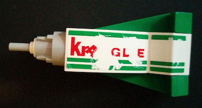

    <h1>Kragle</h1>
    

Kragle is a collection of small, focused tools for building web components. The core feature it brings to the web platform is the ability to "glue" (or "bind") data to the DOM via `KragleTemplate`.

This project follows a monorepo structure and currently houses the following packages:

* [`kragle-element`](./packages/kragle-element) - A thin wrapper class ontop of `HTMLElement` that provides convenient integration with `KragleTemplate`.
* [`kragle-template`](./packages/kragle-template) - A small class for creating instances of `HTMLTemplateElement` that have bindings for inserting data into the markup quickly and easily.
